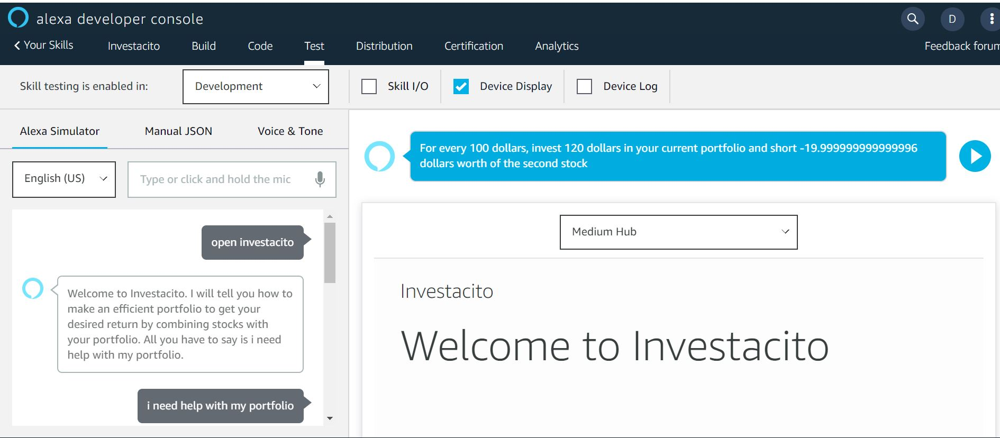
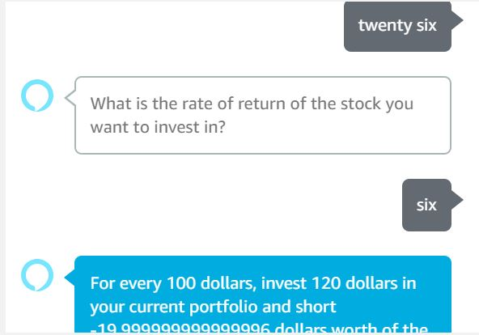
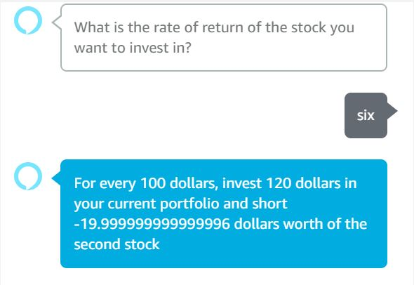

# Alexa... play Investacito
An alexa skill that works on the principles of the CAPM and helps the user calculate the most suitable portfolio with the assets of his choice and the rate of return of his choice.

# Setup:

1. Clone the repo and do a ` npm install ` to get the node dependencies.
2. Create an Amazon Developer account and make a new alexa skill.
3. Upload the alexa.json file to get the intents.
4. Use AWS to create a lambda function and "build the model" for the skill.
5. Ask Investacito to help you
6. Enjoy getting help with Investac4to

# How it looks:

